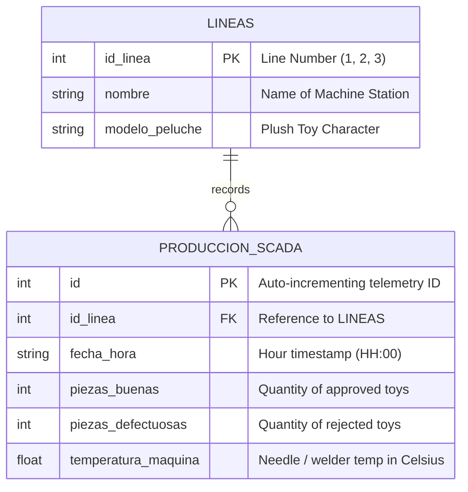

# 🏛️ System Architecture - SCADA Plush Toy Manufacturing Platform

Welcome to the architectural specification for the **Plush Toy Factory SCADA Monitoring System**. This document provides an exhaustive breakdown of the hardware simulation, persistence models, data pipeline, and presentation layers for software engineers, interns, and technical contributors.

---

## 1. High-Level Concept: What is SCADA?

**SCADA** stands for **Supervisory Control and Data Acquisition**. In physical manufacturing:
- **PLCs (Programmable Logic Controllers)** are rugged industrial computers installed directly on factory machines (e.g., sewing machines, stuffing nozzles, ultrasonic welders).
- **Sensors** detect physical events (e.g., photo-electric eye counts completed teddy bears, infrared thermocouple reads needle temperature).
- **SCADA Layer** collects these signals, stores them in structured databases, and displays operational KPIs (Key Performance Indicators) to plant managers in real time.

```
+-----------------------------------------------------------------------------------+
|                              PHYSICAL FACTORY FLOOR                                |
|                                                                                   |
|  [ Sewing Station #1 ]        [ Stuffing Station #2 ]      [ Embroidery #3 ]      |
|    (Teddy Bear Body)             (Husky Filling)             (Panda Eyes)         |
|           |                             |                          |              |
|      [ PLC #1 ]                    [ PLC #2 ]                 [ PLC #3 ]          |
+-----------|-----------------------------|--------------------------|--------------+
            | (TCP/IP Pulses)             |                          |
            +----------------------+------+--------------------------+
                                   |
                                   v
+-----------------------------------------------------------------------------------+
|                           EDGE INGESTION & DATA LAYER                             |
|                                                                                   |
|     db_setup.py (Telemetry Generator) <---> SQLite DB (fabrica_peluches.db)        |
|                                                                                   |
|     Tables:                                                                       |
|     - lineas (Production line metadata & plush model mapping)                     |
|     - produccion_scada (Timestamped hourly metrics, scrap counts, temperature)    |
+-----------------------------------------------------------------------------------+
                                   |
                                   v
+-----------------------------------------------------------------------------------+
|                        ANALYTICS & PROCESSING (Python)                            |
|                                                                                   |
|     - SQLite Query Engine (Parameterized JOINs & Aggregations)                     |
|     - Pandas DataFrame Ingestion & Metric Calculations:                            |
|         * Total Good Units = SUM(piezas_buenas)                                   |
|         * Scrap Rate (%) = (SUM(malas) / (SUM(buenas) + SUM(malas))) * 100        |
|         * Average Head Temp = AVG(temperatura_maquina)                            |
|         * Line Operational State = "Optimal" vs "Action Required"                 |
+-----------------------------------------------------------------------------------+
            |                                         |
            v                                         v
+-------------------------------------+   +-----------------------------------------+
|     INTERACTIVE PRESENTATION        |   |       OFFLINE / REPORTING EXPORTS       |
|                                     |   |                                         |
|  Streamlit Dashboard                |   |  - Matplotlib Static Reporter           |
|  (app_dashboard.py)                 |   |    (dashboard_peluches.py -> .png)        |
|  - Altair trend line graphs         |   |                                         |
|  - Temperature gradient area chart  |   |  - CSV Exporter for ERP/Spreadsheets    |
|  - Real-time PLC Pulse injector     |   |    (generar_csv.py -> .csv)             |
|                                     |   |                                         |
|  Web SCADA Client                   |   |                                         |
|  (dashboard_web.html + Chart.js)    |   |                                         |
+-------------------------------------+   +-----------------------------------------+
```

---

## 2. End-to-End Data Pipeline

The lifecycle of a single manufacturing metric passes through 4 key stages:

### Stage 1: Ingestion / Telemetry Simulation (`db_setup.py`)
In a real factory, PLCs push telemetry over industrial protocols like **Modbus TCP**, **OPC-UA**, or **MQTT**. In our software simulator:
- `db_setup.py` synthesizes historical records representing the previous 8 hours of work.
- It injects deliberate anomalies (e.g., at 12:00, needle overheating to `85.5 °C` causing a spike of 10 defective units) to test anomaly detection systems.

### Stage 2: Relational Persistence (`fabrica_peluches.db`)
Data is stored relationally in SQLite using 3rd Normal Form (3NF):
- `lineas` maintains reference integrity for machine lines.
- `produccion_scada` records high-frequency telemetry linked via foreign key `id_linea`.

### Stage 3: Query & Business Logic Layer (`app_dashboard.py`)
Instead of pulling entire tables into memory indiscriminately, the application executes targeted, parameterized SQL queries:

```sql
SELECT 
    p.fecha_hora,
    p.piezas_buenas,
    p.piezas_defectuosas,
    p.temperatura_maquina,
    l.nombre AS linea,
    l.modelo_peluche
FROM produccion_scada p
JOIN lineas l ON p.id_linea = l.id_linea
WHERE p.id_linea = ?
ORDER BY p.id ASC;
```

Pandas transforms the relational records into an in-memory DataFrame:
$$\text{Scrap Rate} = \left( \frac{\sum \text{Defects}}{\sum \text{Good} + \sum \text{Defects}} \right) \times 100$$

If $\text{Scrap Rate} \ge 5\%$, the system flags the production line as **⚠️ Action Required**.

### Stage 4: Multi-Channel Presentation
The data can be consumed via 3 distinct channels depending on the user's role:
1. **Plant Operators & Managers**: Interactive web dashboard running Streamlit (`app_dashboard.py`).
2. **Shift Supervisors**: Automatic daily image export (`dashboard_peluches.png`).
3. **Financial / ERP Auditors**: Structured CSV files with pre-calculated Excel percentage formulas (`scada_peluches.csv`).

---

## 3. Database Schema Deep Dive

### Entity-Relationship Diagram



---

## 4. Design Patterns & Principles

1. **Separation of Concerns (SoC)**:
   - Data generation (`db_setup.py`), presentation (`app_dashboard.py`), and file reporting (`generar_csv.py`) are strictly modularized.
2. **Parameterized Queries**:
   - SQLite queries use placeholder parameters (`?`) rather than string concatenation to prevent SQL injection vulnerabilities.
3. **Graceful Fallbacks**:
   - If total production is zero, scrap percentage calculations gracefully handle division-by-zero checks.
4. **Idempotence**:
   - `db_setup.py` can be executed repeatedly; it uses `CREATE TABLE IF NOT EXISTS` and resets tables cleanly before repopulating.

---

## 5. Extensibility & Future Roadmap

For junior software engineers looking to enhance the platform:
- [ ] **MQTT / OPC-UA Listener**: Replace simulated pulses with an asynchronous `asyncio` listener subscribing to actual MQTT broker topics.
- [ ] **Authentication & Roles**: Implement role-based access control (Operator, Supervisor, Admin) using Streamlit Authenticator.
- [ ] **Automated Alerting**: Integrate Slack/Discord webhooks or SMTP emails whenever `temperatura_maquina` exceeds $80.0^\circ\text{C}$.
- [ ] **PostgreSQL Migration**: Switch from SQLite to an enterprise PostgreSQL or TimescaleDB instance for massive time-series ingestion.
